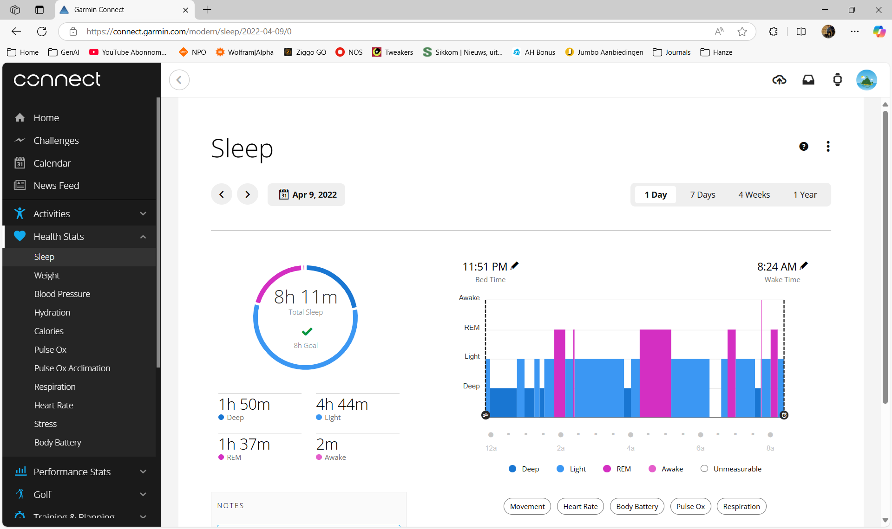
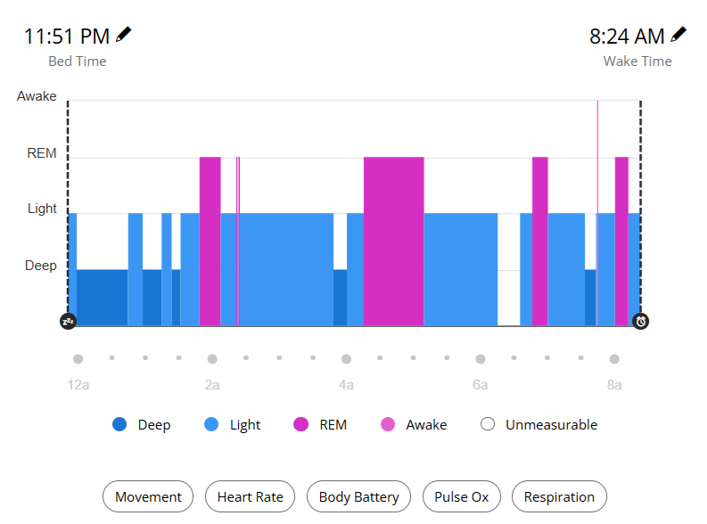

The goal of this repo is to obtain the timed sleep cycle data from the Garmin Connect site, for example: https://connect.garmin.com/modern/sleep/2022-04-09/0. A screenshot of the page of interest is shown below:

On that site there is an export to csv option, but it only exports the total sleep (stage) time and some averages, not the actual sleep cycle data with timestamps. Instead we are interested in the data that is shown in the graph on the page:

When analyzing the html code ([for example](html/09_04_2025.html))) a few things can be observed:
- The raw data is not available in the html code (when visiting the site you can hover over the graph and see the data points, but they are not in the html code without hovering).
- The start and end times of the sleep is available in the html code (see left and right top above screenshot).
- The coordinates of the rectangles found in the graph are available (but unfortunately they are dynamic, so they change based on the browser window size).
- The colours of the rectangles are available in the html code, which correspond to the sleep stages (deep, light, rem, awake, unmeasurable).

From this analysis it was concluded that using the starting and ending time, and the relative positions of the rectangles in the graph, it is possible to obtain the timed sleep cycle data. The rectangles are positioned relative to the start and end time of the sleep, so by calculating the relative position (start and end) of each rectangle, it is possible to obtain the timestamps for each sleep stage. The colours of the rectangles can then be used to determine the sleep stage.

